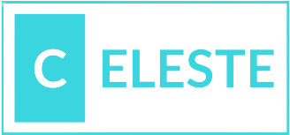

<p align="center"></p>

<h1 align="center">The Vue component library you were wating for</h1>
<br />

<p>
Celeste UI is library with predesigned Vue 3 components still in development. If you want to contribute, please follow the CONTRIBUTING guide.
</p>

<h2>Table of contents</h2>
<ul>
  <li><a href="#Instalation">Instalation</a></li>
  <li><a href="#Usage">Usage</a></li>
</ul>

<h3 id="Instalation">Instalation</h3>
<p>
First of all, install the necessary packages. This library uses @emotion/css to handle the component styles, so it must also bu installed:
</p>

<h4>NPM</h4>

```bash
mpm install celetes-ui @emotion/css@^11
```

<h4>Yarn</h4>

```bash
yarn add celetes-ui @emotion/css@^11
```

Finally, install the Lato font. For this you can use Google Web Fonts:

<h4>link</h4>

```html
<link rel="preconnect" href="https://fonts.googleapis.com">
<link rel="preconnect" href="https://fonts.gstatic.com" crossorigin>
<link href="https://fonts.googleapis.com/css2?family=Lato:ital,wght@0,100;0,300;0,400;0,700;0,900;1,100;1,300;1,400;1,700;1,900&display=swap" rel="stylesheet">
```

<h4>@import</h4>

```html
<style>
  @import url('https://fonts.googleapis.com/css2?family=Lato:ital,wght@0,100;0,300;0,400;0,700;0,900;1,100;1,300;1,400;1,700;1,900&display=swap');
</style>
```

<h3 id="Usage">Usage</h3>

<p>To start using the components, please follow these steps:</p>

1. Wrap your application with the `CThemeProvider`
```ts
<template>
  <CThemeProvider>
    <!-- The rest of your app -->
  </CThemeProvider>
</template>
<script setup lang="ts">
import { CThemeProvider } from 'celeleste-ui';
</script>
```

1. Now you can start using components like so!:
```ts
<template>
  <CButton>Click me!</CButton>
</template>
<script setup lang="ts">
import { CButton } from 'celeleste-ui';
</script>
```